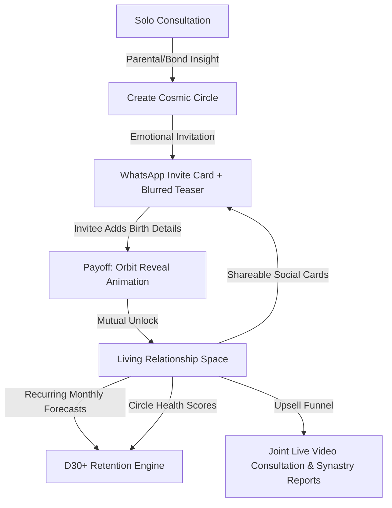

# 🌌 Cosmic Circles — AstroLive

<div align="center">


<br />
### 🌐 **[https://cosmic-circle-two.vercel.app/](https://cosmic-circle-two.vercel.app/)**

[](https://cosmic-circle-two.vercel.app/)

<br />

**Transforming one-off astrology consultations into viral, ongoing social relationship companions.**

[⚡ Try Live Demo](https://cosmic-circle-two.vercel.app/) • [📖 Product Strategy](#-product-concept--growth-engine) • [🚀 Interactive User Flow](#-interactive-demo-flow) • [🛠️ Architecture](#%EF%B8%8F-tech-stack--architecture)

</div>

---

> ### 🌟 **Try the Live Interactive Experience:**
> 👉 **[https://cosmic-circle-two.vercel.app/](https://cosmic-circle-two.vercel.app/)**
> 
> *Test the entire loop directly on your phone or browser: from Rhea's consultation recap, creating a Circle for Mom, switching personas with the floating button, to unlocking the cosmic orbit reveal animation!*

---

## 🔮 Executive Summary & Problem Statement

**AstroLive** users frequently book a single astrology consultation during critical life decisions, but the platform faces the classic single-use drop-off challenge:

> *How do we convert a transactional, solo consultation into long-term retention, organic viral referrals, and repeat high-margin monetization?*

### 💡 The Solution: Cosmic Circles
**Cosmic Circles** turns astrology into a shared, two-person relationship space. After an initial reading reveals connection dynamics, the user creates a Circle with someone important in their life (Mom, Partner, Sibling, Friend, Mentor, or Boss). 

The full joint forecast **only unlocks when both members join**, creating an organic, emotional referral loop. Once unlocked, the Circle becomes a living hub with **monthly recurring forecasts, relationship health tracking, practical action suggestions, and joint astrologer booking upsells**.

---

## 📈 Growth Engine & Business Impact



### 1. 💌 Organic Referral & Viral Loop
* **Personalized Invitations**: *"Rhea wants to understand your bond better."*
* **Curiosity-Driven Teasers**: Blurred forecast previews that require the second person to join to fully uncover.
* **Frictionless Onboarding**: Invitee only enters their birth details—no tedious sign-up forms.

### 2. 🔄 Habit-Forming Retention
* **Monthly Forecast Updates**: Unlocks new conversation windows (e.g. *"Best Conversation Window: Aug 22–28"*).
* **Dynamic Relationship Health Score**: Tracks Harmony (82%), Communication (74%), and Emotional Support (88%).
* **Actionable Guidance**: Real-world utility prompts (*"Send a soft check-in today"*, *"Plan the career talk for this weekend"*).

### 3. 💎 Clear Monetization & LTV Expansion
* **Joint Live Consultation Booking**: ₹599 for a 3-way video session (User + Invitee + Astrologer).
* **Full Synastry Reports**: Multi-page composite chart breakdowns.
* **12-Month Relationship Forecasts**: Premium annual subscriptions.

---

## 📱 Features & Interactive Demo Flow

Experience the entire end-to-end loop directly in the prototype at **[cosmic-circle-two.vercel.app](https://cosmic-circle-two.vercel.app/)**:

| Stage | Screen / Flow | Key Capabilities |
| :--- | :--- | :--- |
| **01** | **Home & Post-Consultation** | View recent reading with *Pandit Arjun Shastri* highlighting connection to Mom, with contextual Circle trigger CTA. |
| **02** | **Create Circle** | Select relationship category (Mom, Partner, Friend, Sibling, Boss, Mentor) and enter rough birth month/year. |
| **03** | **Locked Teaser Screen** | Blurred preview of the synastry chart with WhatsApp share sheet and copy link actions. |
| **04** | **Dual Persona Switcher** | Floating interactive pill to seamlessly toggle perspectives between **Rhea (Creator)** and **Sunita (Mom/Invitee)**. |
| **05** | **Invitee Join & Reveal** | Invitee enters birth date/time/place; triggers the **Framer Motion Cosmic Orbit Reveal** animation. |
| **06** | **Circle Hub (Living Space)** | Monthly forecast timeline, circle health progress meters, actionable tips, and downloadable share cards. |
| **07** | **Joint Booking & Premium** | Integrated consultation scheduler with date/time pickers, astrologer profiles, and tiered pricing. |

---

## 🛠️ Tech Stack & Architecture

Built with modern, high-performance web standards:

- **Live URL**: [https://cosmic-circle-two.vercel.app/](https://cosmic-circle-two.vercel.app/)
- **Framework**: [Next.js 16 (App Router + Turbopack)](https://nextjs.org/)
- **UI Library**: [React 19](https://react.dev/)
- **Styling**: [Tailwind CSS v4](https://tailwindcss.com/) with curated HSL color tokens and custom glassmorphism
- **Animations**: [Framer Motion 13](https://www.framer.com/motion/) (smooth spring transitions, orbital merges, particle bursts)
- **State Management**: [Zustand 5](https://github.com/pmndrs/zustand) (reactive, in-memory dual persona & circle lifecycle store)
- **Icons**: [Lucide React](https://lucide.dev/)
- **Typography**: Google Fonts (*Playfair Display* for celestial headers + *Inter* for clean typography)

---

## 📂 Project Structure

```
cosmic-circles/
├── src/
│   ├── app/
│   │   ├── circle/
│   │   │   └── [id]/
│   │   │       ├── book/         # Joint astrologer video consultation booking
│   │   │       ├── join/         # Invitee onboarding & birth details entry
│   │   │       ├── reveal/       # Cosmic orbital unlock animation
│   │   │       ├── teaser/       # Blurred curiosity card & WhatsApp share modal
│   │   │       └── page.tsx      # Living Circle Hub (Forecasts, Health, Actions)
│   │   ├── circles/              # Multi-circle directory & status list
│   │   ├── consultation/[id]/    # Astrologer takeaway & Circle entry CTA
│   │   ├── create-circle/        # 2-step Circle creation wizard
│   │   ├── premium/              # Premium tier comparison & free trial paywall
│   │   ├── globals.css           # Design tokens, celestial backgrounds & glows
│   │   ├── layout.tsx            # Mobile viewport frame & theme configuration
│   │   └── page.tsx              # AstroLive Home with dynamic notifications
│   ├── components/
│   │   ├── bottom-nav.tsx        # Persistent bottom navigation shell
│   │   └── persona-switcher.tsx  # Interactive Rhea ↔ Mom toggle for testing
│   ├── data/
│   │   └── mock.ts               # Seeded users, astrologers, forecasts & health metrics
│   └── store/
│       └── app-store.ts          # Zustand state machine managing dual personas & unlock status
├── public/                       # Static SVGs and branding assets
├── next.config.ts                # Next.js configuration
├── package.json
└── tsconfig.json
```

---

## 🚀 Getting Started

### ⚡ Live Demo (No Install Needed)
Visit **[https://cosmic-circle-two.vercel.app/](https://cosmic-circle-two.vercel.app/)** to try it immediately on mobile or desktop!

### Local Setup
```bash
# 1. Clone & Install
git clone https://github.com/KDGIT005/Cosmic-Circle.git
cd Cosmic-Circle
npm install

# 2. Run Local Development Server
npm run dev

# 3. Production Build
npm run build
npm run start
```
Open [http://localhost:3000](http://localhost:3000) on your browser.

---

## 🎮 How to Test the Demo Flow

1. **Start on Home (`/`) as Rhea**: Tap on the **Recent Consultation** card or the **Create a Circle** button.
2. **Create Circle**: Pick *Mom (Sunita)*, choose birth details, and click **Create Circle**.
3. **Inspect the Teaser**: Notice the blurred preview card and tap **Send to Sunita** to view the share sheet.
4. **Switch Persona**: Click the floating **"Viewing as Rhea"** pill at the bottom to switch to **"Sunita"** (Mom).
5. **Unlock the Circle**: Fill in Sunita's birth date and click **Unlock Your Circle**.
6. **Watch the Reveal**: Experience the cosmic orbit merge animation.
7. **Explore Circle Hub**: Check out the Monthly Forecast, Circle Health Scores, Action suggestions, Shareable Insight Card, and book a **Joint Consultation**.

---

<div align="center">

### 🌌 [Experience Cosmic Circles Live on Vercel](https://cosmic-circle-two.vercel.app/)

Crafted with 💜 for **AstroLive** • Built for real-world growth & engagement

</div>
